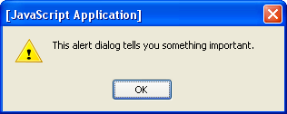
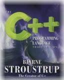

!SLIDE slideone

## Ruby on Rails
## &nbsp;
####Sarah Mei
#####@sarahmei
#####sarahmei@gmail.com

!SLIDE

<table height="100%">
<tr>
<td valign="top">
&nbsp; 

</td>
</tr>
</table>

!SLIDE

<table height="100%">
<tr>
<td valign="top">
&nbsp; 
 

</td>
</tr>
</table>

!SLIDE

<table height="100%">
<tr>
<td valign="top">
&nbsp; 
 
 

 

<H1>(etc.)</H1>
</td>
</tr>
</table>

!SLIDE chibis

!SLIDE ucsd

!SLIDE calspaceprequel

!SLIDE calspace

!SLIDE mosaic

!SLIDE astrocam

!SLIDE brazil

!SLIDE webappdiagram

!SLIDE

<table width="100%">
<tr>
<td align="center">

</td>
<td align="center">

</td>
</tr>
<tr>
<td>&nbsp;</td>
<td>&nbsp;</td>
</tr>
</table>
# &nbsp;
# &nbsp;
# &nbsp;

!SLIDE

<table width="100%">
<tr>
<td align="center">

</td>
<td align="center">

</td>
</tr>
<tr>
<td align="center">
Language
</td>
<td align="center">
Framework
</td>
</tr>
</table>
# &nbsp;
# &nbsp;

!SLIDE

<code>puts "Hello, world!"</code>

!SLIDE

<b><pre><code>
class HelloWorldApp {
 public static void main(String[] args) {
  System.out.println("Hello, world!");
 }
}
</code></pre></b>

!SLIDE

<table width="100%">
<tr>
<td align="center">

</td>
<td align="center">

</td>
</tr>
<tr>
<td align="center">
Language
</td>
<td align="center">
Framework
</td>
</tr>
</table>
# &nbsp;
# &nbsp;

!SLIDE

## Step 1:

<pre><code>
rails tweetbook
</code></pre>

!SLIDE

## Step 2: 

<pre><code>
cd tweetbook
ruby script/generate scaffold 
  status_update 
  name:string 
  status:text
rake db:migrate
</code></pre>

!SLIDE

## What does this get us?
# &nbsp;
* A status_updates table
* Basic HTML forms for status updates
* Everything's wired up!

!SLIDE

## Step 3:

<pre><code>
 ruby script/server
</code></pre>

!SLIDE newstatusupdate

!SLIDE

## CRUD

!SLIDE

* No @#$^* XML files to edit
* No configuration of any kind
* You can override any of the defaults

!SLIDE

# Why Rails?

!SLIDE

# Why not?

!SLIDE slideone

## Thank you!
## &nbsp;
#### Sarah Mei
##### @sarahmei
##### sarahmei@gmail.com
# &nbsp;

Image credits: NASA/Johnson Space Center, NCSA/University of Illinois, David Heinemeier Hansson, Yukihiro Matsumoto, LookSmart, Sun Microsystems, Silicon Graphics, Bjarne Stroustroup, PHP Foundation, and Flickr users thisisbossi, holderbyphotography, and geekwithoutacause

