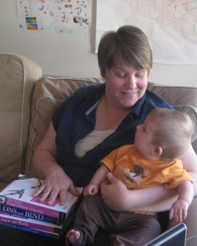
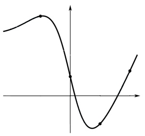
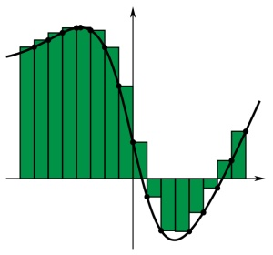
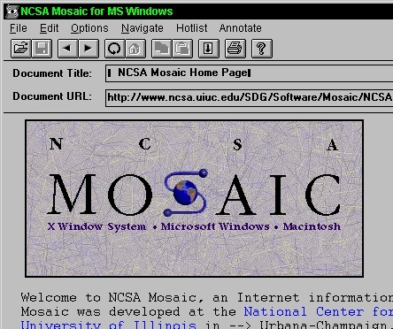

!SLIDE slideone

## Ruby on Rails
####Sarah Mei
#####sarahmei@gmail.com

!SLIDE schedule

## 1 min: Me
## 4 min: Ruby
## 4 min: Rails
## 1 min: Wrapup

!SLIDE schedule

## 1 min: Me
## 4 min: Ruby
## 4 min: Rails
## 1 min: Wrapup

!SLIDE

<table>
<tr>
<td>

</td>
<td valign="top">
&nbsp;
</td>
</tr>
</table>

!SLIDE

<table>
<tr>
<td>

</td>
<td valign="top">

</td>
</tr>
</table>

!SLIDE

<table>
<tr>
<td>

</td>
<td valign="top">
 

</td>
</tr>
</table>

!SLIDE

<table>
<tr>
<td>

</td>
<td valign="top">
 

</td>
</tr>
</table>

!SLIDE

<table>
<tr>
<td>

</td>
<td valign="top">
 

 

</td>
</tr>
</table>

!SLIDE

<table>
<tr>
<td>

</td>
<td valign="top">
 

 
 
 

</td>
</tr>
</table>

!SLIDE

!SLIDE centereverything

!SLIDE centereverything

!SLIDE centereverything

!SLIDE centereverything

!SLIDE schedule

## 1 min: Me
## 4 min: Ruby
## 4 min: Rails
## 1 min: Wrapup

!SLIDE centereverything

!SLIDE

<code>puts "Hello, world!"</code>

!SLIDE

# Hello World
<b><pre><code>
class HelloWorldApp {
 public static void main(String[] args) {
  System.out.println("Hello, world!");
 }
}
</code></pre></b>

!SLIDE

<code>puts "Hello, world!"</code>

!SLIDE schedule

## 1 min: Me
## 4 min: Ruby
## 4 min: Rails
## 1 min: Wrapup

!SLIDE centereverything

<table width="100%">
<tr>
<td>

</td>
<td align="right">
&nbsp;
</td>
</tr>
</table>

!SLIDE

<table width="100%">
<tr>
<td>

</td>
<td align="right">

</td>
</tr>
</table>

!SLIDE

### A dynamic, open source, 
### object-oriented programming language focused on 
### simplicity and productivity. 
#&nbsp;
#&nbsp;
#&nbsp;
#&nbsp;
#&nbsp;

!SLIDE

### A dynamic, open source, 
### object-oriented programming language focused on 
### simplicity and productivity. 
#&nbsp;
<code>puts "Hello, world!"</code>
#&nbsp;
#&nbsp;
#&nbsp;

!SLIDE

### A dynamic, open source, 
### object-oriented programming language focused on 
### simplicity and productivity. 
#&nbsp;
#&nbsp;
#&nbsp;
#&nbsp;
#&nbsp;

!SLIDE

### A dynamic, open source, 
### object-oriented programming language focused on 
### simplicity and productivity. 
#&nbsp;
<pre><code>
my_variable = "Hello"
my_variable = 5
</code></pre>
#&nbsp;
#&nbsp;
#&nbsp;

!SLIDE

### A dynamic, open source, 
### object-oriented programming language focused on 
### simplicity and productivity. 
#&nbsp;
#&nbsp;
#&nbsp;
#&nbsp;
#&nbsp;

!SLIDE

### A dynamic, open source, 
### object-oriented programming language focused on 
### simplicity and productivity. 
#&nbsp;
<code>5.times { print "Taxi!!" } </code>
#&nbsp;
#&nbsp;
#&nbsp;

!SLIDE

### A dynamic, open source, 
### object-oriented programming language focused on 
### simplicity and productivity. 
#&nbsp;
<code>
cities  = %w[ London
              Oslo
              Paris
              Amsterdam
              Berlin ]
visited = %w[Berlin Oslo]
 
puts "I still need to visit the following cities:",
     cities - visited
</code>
#&nbsp;
#&nbsp;
#&nbsp;

!SLIDE

<code>puts "Hello world!"</code>

!SLIDE

<code>
north_america = ["USA", "Canada", "Mexico"]
central_america = ["Guatamala", 

visited = ["USA", "Canada", "Mexico", "Netherlands", "Japan", "Ghana"]
</code>

!SLIDE
!SLIDE

### A dynamic, open source, 
### object-oriented programming language focused on 
### simplicity and productivity. 
#&nbsp;
#&nbsp;
#&nbsp;
#&nbsp;
#&nbsp;

